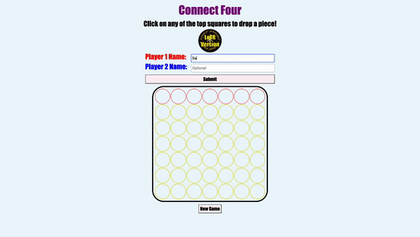

# Connect Four Game

## 🧐 Project Description

This is a connect four project that I created using vanilla JavaScript with ES6 syntax. 

### **How to Play:** 
* Enter you and your opponent's names in the input fields and submit. This step is optional as each players' names default to "Player 1" and "Player 2" if the input fields are left blank.
* Click on any of the circles in the top-most row to drop a piece.
* Click on "New Game" button to reset the board.
